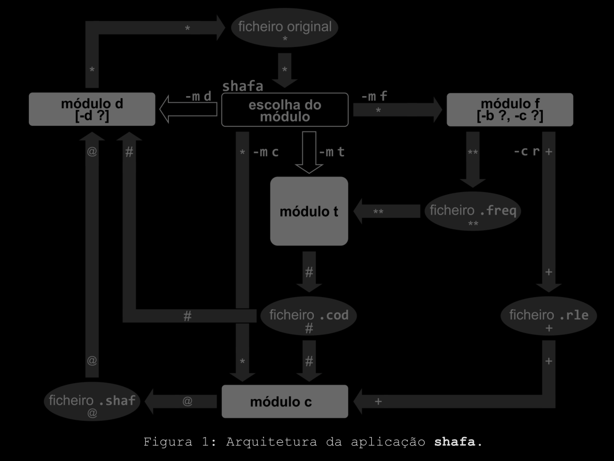

### Trabalho realizado por:
   - Alexandre Flores -> Módulo T
   - Guilherme Fernandes -> Módulo D
   - Rita Lino -> Módulo T
   - Mariana Rodrigues -> Módulo F
   - Matilde Bravo -> Módulo C
   - Miguel Gomes -> Módulo F


## Parte A (Cálculo das freq dos símbolos e compressão RLE)

- Módulo F
    * `-m f` --> executa módulo F
    * `-b x` --> especifica tamanho dos blocos para analise (K|m|M)
    * `-c r` --> força compressão RLE

```sh
$ shafa exemplo.txt -m t
```

## Parte B (Cálculo das tabelas de codificação)

- Módulo T
    * `-m t` --> executa módulo T
```sh
$ shafa exemplo.txt.rle.freq -m t
```

## Parte C (Codificação do ficheiro original ou já comprimido em RLE)

- Módulo C
   * `-m c` --> executa módulo C

```sh
$ shafa exemplo.txt.rle -m c
```

## Parte D (descodificação)
- Módulo D
   * `-m d` --> executa módulo D
   * `-d s` --> força a utilização apenas da descodificação SF (Shannon-Fano)
   * `-d r` --> força a utilização apenas da descodificação RLE

```sh
$ shafa exemplo.txt.rle.shaf -m d
```


